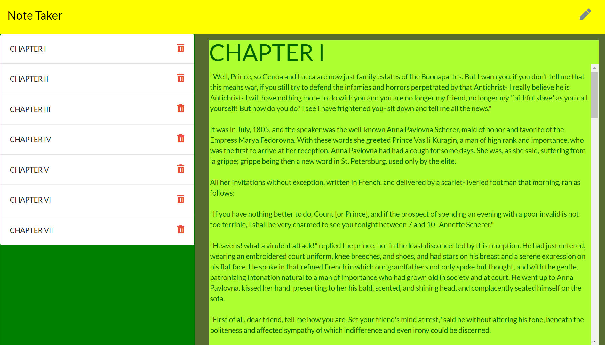

# Note Taker App

2020

### DESCRIPTION

Node app that starts a server on local host port 4000, then allows the user to input notes on notes.html. The user can save, review, and delete the notes as well.

### INSTALLATION INSTRUCTIONS

1. Install the required modules by typing "npm install" or "npm i" in the containing folder using your code editor terminal.
2. Run the app by typing "node server.js" or "node server."
3. The console log will display " Server listening on: http://localhost:4000 ."
4. You can hold control and click on the address to go directly to the note taker html home page.
5. From the note taker home page, click "get started," to be re-directed to the actual not taker page.
6. The user then can type the title, note content, and hit the save icon on the upper right(note the icon will only appear after there is content inputted).
7. Lastly, the user can review the saved notes on the right of the screen and also delete the note by hitting the delete icon to the right of the note.

### BUILT WITH

- [HTML](https://html.com/)
- [CSS](https://www.w3schools.com/css/)
- [Javascript](https://www.javascript.com/)
- [Bootstrap](https://getbootstrap.com/)
- [Font Awesome](https://fontawesome.com/)
- [Node](https://nodejs.org/en/)
- [NPM](https://www.npmjs.com/)

### NODE MODULES USED

- [Express](https://www.npmjs.com/package/express)
- [Fs](https://nodejs.org/api/fs.html)

### AUTHOR

- [Github](https://github.com/alpinelife37)
- [Linkedin](https://www.linkedin.com/in/pnw-web-dev)

MIT License

Copyright (c) [2020][james nelson]

Permission is hereby granted, free of charge, to any person obtaining a copy
of this software and associated documentation files (the "Software"), to deal
in the Software without restriction, including without limitation the rights
to use, copy, modify, merge, publish, distribute, sublicense, and/or sell
copies of the Software, and to permit persons to whom the Software is
furnished to do so, subject to the following conditions:

The above copyright notice and this permission notice shall be included in all
copies or substantial portions of the Software.

THE SOFTWARE IS PROVIDED "AS IS", WITHOUT WARRANTY OF ANY KIND, EXPRESS OR
IMPLIED, INCLUDING BUT NOT LIMITED TO THE WARRANTIES OF MERCHANTABILITY,
FITNESS FOR A PARTICULAR PURPOSE AND NONINFRINGEMENT. IN NO EVENT SHALL THE
AUTHORS OR COPYRIGHT HOLDERS BE LIABLE FOR ANY CLAIM, DAMAGES OR OTHER
LIABILITY, WHETHER IN AN ACTION OF CONTRACT, TORT OR OTHERWISE, ARISING FROM,
OUT OF OR IN CONNECTION WITH THE SOFTWARE OR THE USE OR OTHER DEALINGS IN THE
SOFTWARE.
